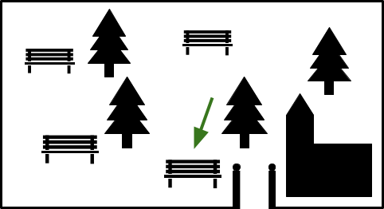

# The Cartesian space

Imagine you want to meet a friend in the city. You might write a message saying "Hey, let's meet in the park at the bench near the entrance by the church." Twenty minutes later, your friend arrives at the said bench. Great! The next day, you want your robotic arm to pick up a red ball: "Hey, pick up the red ball in the second tray, just left to the green ball" Nothing happens. But why? It is such an easy task. Your four year old niece would be able to do it! But robot and you, you just don't speak the same language. You describe a position in the world based on some distinctive points. You rely on your friend to have knowledge about those points and they ability to identify them. The robot has neither the knowledge nor the sensors to be able to identify the distinctive points you were referring to.

Imagine you want to meet your friend in the middle of a desert. "Hey, let's meet at a grey rock near some dune!" might be problematic, as you both don't have knowledge about the region and you cannot rely on your sensors (i.e. eyes) to identify rocks and dunes correctly as they all might look similar and the environment will change in the desert due to wind and other environmental conditions. What do you do? You both take a GPS device and say "Let's meet at 22°13'27.8"N 22°06'55.7"E" Twenty hours later, your friend arrives at the said point. Great! You use a system, which specifies exactly each point on the surface of the earth, and a device which translates your state into the language of the system.

We can talk in a similar way to robots. This means we take the space in which the robot can move and use a system which is able to describe every point within this space. In robotics, we often use the *Cartesian space*. This is just a fancy name for the well known coordinate system with an x- and y-axes (and z-axes in three dimensional space) we draw a thousand times in school.

# Robot poses and degrees of freedom

Within the Cartesian space, we are able to name a point, where the robot should move to. It is often important from which direction a robot's tool points to a position. Imagine for example a robot equipped with a drilling machine. It matters in which direction the hole is drilled, not just at which position. Or a mobile robot which should park in a parking lot. If the rotation of the robot is wrong, it might damage cars nearby.

We therefore use a so-called *pose* to describe how the robot is positioned. In two dimensional space the pose consists of 

* the x-coordinate
* the y-coordinate 
* an angle phi for the rotation

The end-effector cannot move without changing one of these values. If the end-effector rotates around the point (x,y) the angle will change. If it moves horizontally the x-coordinate will change. If it moves vertically the y-coordinate will change. We say that there are three *degrees of freedom*. Things get more complicated the more dimensions we take into account. In three dimensional space we need the x-, y-, and z-coordinates as well as three angles (e.g. roll, pitch, yaw) to describe the pose. There are six degrees of freedom. In four dimensional space there are already ten degrees of freedom.

# Robot kinematics

"Alright, robot!", you say, "Move to (0.1 m, 0.53 m) with a rotation of 1.4 rad!" Nothing happens. But why? If someone would tell us "Move to 22°13'27.8"N 22°06'55.7"E" we would not be able to achieve this without a device which measures for us where we are. This is the same for the robot. GPS is much too inaccurate to determine where the tip of the end-effector is located for most tasks. Imagine we have a robot which should put dishes into the dishwasher. Even an accuracy of 10 cm could result in throwing dishes on the floor. Even though there exist sensors which are able to accurately measure the position of the end-effector, they are often quite expensive. But there are other solutions! For a stationary robot, e.g. a robot arm, we can compute the pose of the endeffector by taking into account the geometry of the robot. This is comparable to predicting the pose of our left index finger by measuring the contraction of every muscle and the length of every bone in our body. The relationship between the geometry of the robot and its movement in the Cartesian space is called *kinematics*. 